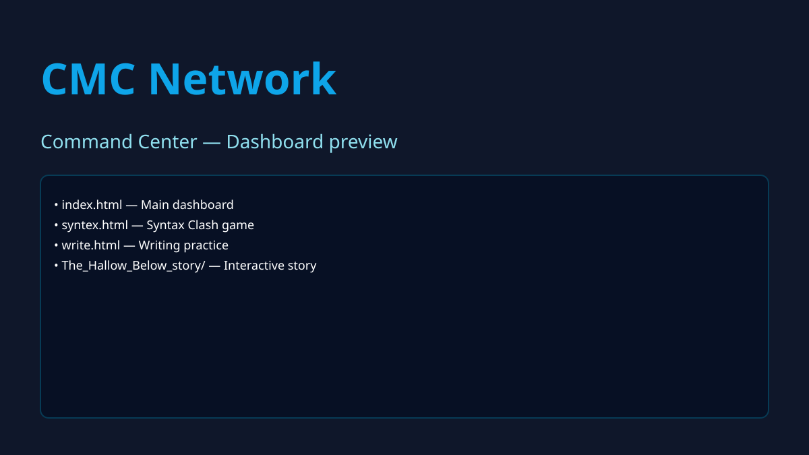

# Command Center

A static, HTML-first dashboard (CMC Network) used for educational materials, interactive exercises, and teacher resources.

> This README was updated automatically to match the repository contents. Please review and edit any project-specific details.

---

## What this is
Command Center (CMC Network) is a static front-end dashboard serving learning materials (PDFs, interactive games, worksheets, and story content) for students and teachers.

### Stack
- Language(s): HTML (primary)
- Framework / runtime: Static HTML + Tailwind via CDN
- Notable libraries: Tailwind CSS (via CDN), Google Fonts

## How it's organized
```
.gitattributes         # Git attributes
.github/               # GitHub workflows or issue templates (if present)
.gitignore
LICENSE
README.md
index.html             # Main dashboard / entry point (CMC Network)
RF.html                # Reading Future materials (legacy page)
RF2_materials.html     # Reading Future Connect 2 materials (links from dashboard)
Test.html
syntex.html            # Syntax / grammar game
toefl_reading_test.html
toefl_writing_test.html
unittest.html
word.html
wordreview.html
wordtest.html
write.html             # Writing practice page
The_Hallow_Below_story/ # Interactive story/book (has its own index.html)
assets/screenshot.svg  # Placeholder screenshot added for README
```

How it fits together: index.html is the main dashboard that links to other static pages (RF, RF2 materials, games like syntex.html, write.html, and the The_Hallow_Below_story book folder). The site is static — pages are navigated by anchor links and standard hyperlinks; interactive behaviour is implemented with client-side JS embedded in the HTML files.

## How to run it
The site is static. The fastest way to preview locally:

```bash
# Clone
git clone https://github.com/CMCKHMER/CommandCenter.git
cd CommandCenter

# Option A: Open directly
# double-click index.html or open it in your browser

# Option B: Serve with Python's simple HTTP server
python -m http.server 8000
# then open http://localhost:8000

# Option C: Serve with npx http-server
npx http-server -p 8000
```

## Project details & usage notes
- index.html is the primary entry point and implements the dashboard UI and navigation to the site's learning modules.
- The `The_Hallow_Below_story/` directory contains an interactive story with its own index.html — useful as an example of multi-page content in this repo.
- Several pages appear to be learning modules or tests (TOEFL pages, word exercises). Inspect each HTML file to find the source content and any assets embedded inline.

## Screenshots
A placeholder screenshot has been added at assets/screenshot.svg — replace it with a real PNG/JPEG screenshot if you want images in the README.



## Contributing
Contributions are welcome:
1. Fork the repository
2. Create a branch: `git checkout -b feature/my-change`
3. Commit: `git commit -m "Describe your change"`
4. Push and open a PR

If you have large media files (images, PDFs), consider using LFS or hosting them externally and linking.

## License
This project is released under the MIT License — see [LICENSE](LICENSE).

## Contact
Repository owner: CMCKHMER

If you'd like an email or project maintainer added here, tell me and I will update the README.
